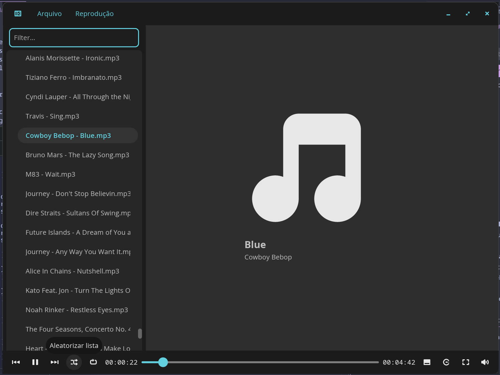

# cosmic-player

---

## Sobre este Fork

Este projeto é um fork customizado do [COSMIC Player da System76](https://github.com/pop-os/cosmic-player) original. Ele introduz diversas melhorias de qualidade de vida, gerenciamento de estado avançado e aprimoramentos na navegação de playlists.

### Principais Melhorias e Recursos

*   **Restauração de Sessão**: O player agora lembra do seu contexto. Ele salva a última música tocada, a estrutura atual da pasta/playlist e o estado de reprodução entre as sessões. Ao reabrir o aplicativo, ele restaura a lista, marca a música em execução e rola a tela até ela.
*   **Pesquisa e Filtro em Tempo Real**: Adicionado um campo de pesquisa rápido diretamente na barra lateral para filtrar facilmente grandes bibliotecas de música, sem perder a estrutura original das pastas.
    *   **Navegação por Teclado**: Pressione `F3` em qualquer lugar do aplicativo para focar instantaneamente no campo de pesquisa. Use as setas para `Cima` e `Baixo` para navegar pelos resultados filtrados e pressione `Enter` para tocar a faixa selecionada.
    *   **Preservação de Estado**: Limpar o filtro de pesquisa restaura perfeitamente toda a playlist original e centraliza novamente o destaque visual na música que está tocando no momento.
*   **Aleatório (Shuffle) Aprimorado**: A lógica de embaralhar foi refatorada para sincronizar perfeitamente com a música ativa. Randomizar a lista agora reorganiza os itens corretamente ao redor da faixa em execução, evitando dessincronizações visuais. O embaralhamento utiliza o consagrado algoritmo de **Fisher-Yates** (implementado de forma otimizada pela biblioteca `rand` do Rust), garantindo uma distribuição estatisticamente justa e verdadeiramente aleatória das músicas.
*   **Rolagem Automática (Auto-Scroll)**: Um novo mecanismo unificado de rolagem garante que a barra lateral role automaticamente para manter a música em reprodução visível durante a inicialização, ao carregar arquivos e ao embaralhar a lista.